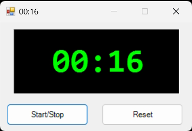

# Csharp

Some simple C# projects:

## [Clean Architecure Skeleton](/_Clean_Arch_/)
A simple skeleton to create new projects based on the Clean Archteture.  

 
 

## [Exercises](/Exercises/)
Some C# exercises, such as algorithms and problem solving. Just for fun! =]  

 
 

## [Cronômetro (WinForms)](/Stopwatch/)

 
 

